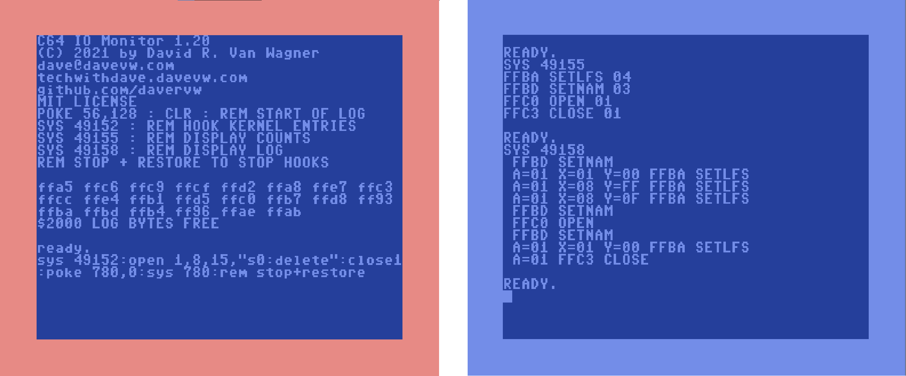

# C64 IO_Monitor #

Author: [David R. Van Wagner](http://techwithdave.davevw.com "David R. Van Wagner")

6502 Assembly project to monitor C64 Kernel I/O entry points usage.

Hooks entry points and increments counts as Kernel calls are made, 
with max count of 255 each.  Works by copying C64 ROMs to RAM, 
patching RAM, and running from RAM (no, it doesn't patch lower 
memory indirect jumps).  Optionally logs a trace of all individual
calls with arguments and return values if memory is reserved
(upper BASIC memory limit lowered prior to initializing).

Common use is to perform operations in BASIC, then display
counts/trace to see what Kernel calls were made.  Interestingly,
see what Kernel I/O calls are made when you make a syntax error.

Usage:

    LOAD "0:*",8,1
    POKE 56,128 : REM RESERVE 8K FOR LOG
    NEW
    SYS 49152 : REM INITIALIZE HOOKS
    SYS 49155 : DISPLAY COUNTS
    SYS 49158 : DISPLAY LOG
    REM STOP + RESTORE TO STOP

Example:

Produced with [ACME](https://sourceforge.net/projects/acme-crossass/ "ACME Cross-Assembler") and [https://github.com/Esshahn/acme-assembly-vscode-template](https://github.com/Esshahn/acme-assembly-vscode-template "acme-assembly-vscode-template")

[Built C64 disk image is here](https://github.com/davervw/c64-io_monitor/raw/main/build/io_monitor.d64) and [PRG file is here](https://github.com/davervw/c64-io_monitor/raw/main/build/io_monitor.prg).
